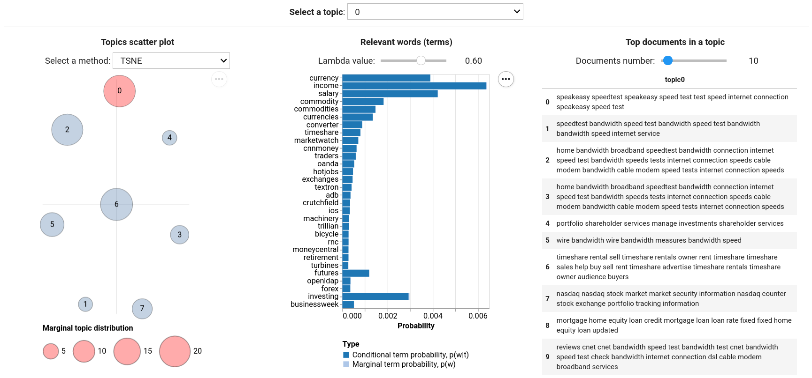

# Biterm Topic Model


[](https://bitermplus.readthedocs.io/en/latest/?badge=latest)

[](https://github.com/maximtrp/bitermplus/issues)
[](https://pepy.tech/project/bitermplus)


**Bitermplus** is a high-performance implementation of the [Biterm Topic Model](https://citeseerx.ist.psu.edu/viewdoc/download?doi=10.1.1.402.4032&rep=rep1&type=pdf) for short text analysis, originally developed by Xiaohui Yan, Jiafeng Guo, Yanyan Lan, and Xueqi Cheng. Built on a cythonized version of [BTM](https://github.com/xiaohuiyan/BTM), it features OpenMP parallelization and a modern scikit-learn compatible API for seamless integration into ML workflows.

## Key Features

- **Scikit-learn Compatible API** — Familiar `fit()`, `transform()`, and `fit_transform()` methods for easy adoption
- **ML Pipeline Integration** — Seamless compatibility with sklearn workflows, cross-validation, and grid search
- **High-Performance Computing** — Cythonized implementation with OpenMP parallel processing for speed
- **Advanced Inference Methods** — Multiple approaches including sum of biterms, sum of words, and mixed inference
- **Comprehensive Model Evaluation** — Built-in perplexity, semantic coherence, and entropy metrics
- **Intuitive Topic Interpretation** — Simple extraction of topic keywords and document-topic assignments
- **Flexible Text Preprocessing** — Customizable vectorization pipeline with sklearn CountVectorizer integration

## Donate

If you find this package useful, please consider donating any amount of money. This will help me spend more time on supporting open-source software.

<a href="https://www.buymeacoffee.com/maximtrp" target="_blank"></a>

## Requirements

- **Python** ≥ 3.8
- **NumPy** ≥ 1.19.0 — Numerical computing foundation
- **Pandas** ≥ 1.2.0 — Data manipulation and analysis
- **SciPy** ≥ 1.6.0 — Scientific computing library
- **scikit-learn** ≥ 1.0.0 — Machine learning utilities and API compatibility
- **tqdm** ≥ 4.50.0 — Progress bars for model training

## Installation

### Standard Installation

Install the latest stable release from PyPI:

```bash
pip install bitermplus
```

### Development Version

Install the latest development version directly from the repository:

```bash
pip install git+https://github.com/maximtrp/bitermplus.git
```

### Platform-Specific Setup

**Linux/Ubuntu:** Ensure Python development headers are installed:

```bash
sudo apt-get install python3.x-dev  # where x is your Python minor version
```

**Windows:** No additional setup required with standard Python installations.

**macOS:** Install OpenMP support for parallel processing:

```bash
# Install Xcode Command Line Tools and Homebrew (if not already installed)
xcode-select --install
# Install OpenMP library
brew install libomp
pip install bitermplus
```

If you encounter OpenMP compilation errors, configure the environment:

```bash
export LDFLAGS="-L/opt/homebrew/opt/libomp/lib"
export CPPFLAGS="-I/opt/homebrew/opt/libomp/include"
pip install bitermplus
```

## Quick Start

### Sklearn-style API (Recommended)

```python
import bitermplus as btm

# Sample documents
texts = [
    "machine learning algorithms are powerful",
    "deep learning neural networks process data",
    "natural language processing understands text"
]

# Create and train model
model = btm.BTMClassifier(n_topics=2, random_state=42)
doc_topics = model.fit_transform(texts)

# Get topic keywords
topic_words = model.get_topic_words(n_words=5)
print("Topic 0:", topic_words[0])
print("Topic 1:", topic_words[1])

# Evaluate model
coherence_score = model.score(texts)
print(f"Coherence: {coherence_score:.3f}")
```

### Traditional API

```python
import bitermplus as btm
import numpy as np
import pandas as pd

# Importing data
df = pd.read_csv(
    'dataset/SearchSnippets.txt.gz', header=None, names=['texts'])
texts = df['texts'].str.strip().tolist()

# Preprocessing
X, vocabulary, vocab_dict = btm.get_words_freqs(texts)
docs_vec = btm.get_vectorized_docs(texts, vocabulary)
biterms = btm.get_biterms(docs_vec)

# Initializing and running model
model = btm.BTM(
    X, vocabulary, seed=12321, T=8, M=20, alpha=50/8, beta=0.01)
model.fit(biterms, iterations=20)
p_zd = model.transform(docs_vec)

# Metrics
coherence = model.coherence_
perplexity = model.perplexity_
```

### Visualization

Visualize your topic modeling results with [tmplot](https://github.com/maximtrp/tmplot):

```bash
pip install tmplot
```

```python
import tmplot as tmp

# Generate interactive topic visualization
tmp.report(model=model, docs=texts)
```



## Documentation

**[Sklearn-style API Guide](https://bitermplus.readthedocs.io/en/latest/sklearn_api.html)**
Complete guide to the modern sklearn-compatible interface with examples and best practices

**[Traditional API Tutorial](https://bitermplus.readthedocs.io/en/latest/tutorial.html)**
In-depth tutorial covering advanced topic modeling techniques and model evaluation

**[API Reference](https://bitermplus.readthedocs.io/en/latest/bitermplus.html)**
Comprehensive documentation of all functions, classes, and parameters

## Migration from v0.7.0 to v0.8.0

The traditional API remains fully compatible. The new sklearn-style API provides a simpler alternative:

### Old approach (still works)

```python
# Multi-step manual process
X, vocabulary, vocab_dict = btm.get_words_freqs(texts)
docs_vec = btm.get_vectorized_docs(texts, vocabulary)
biterms = btm.get_biterms(docs_vec)

model = btm.BTM(X, vocabulary, seed=42, T=8, M=20, alpha=50/8, beta=0.01)
model.fit(biterms, iterations=100)
p_zd = model.transform(docs_vec)
```

### New approach (recommended)

```python
# One-liner with automatic preprocessing
model = btm.BTMClassifier(n_topics=8, random_state=42, max_iter=100)
p_zd = model.fit_transform(texts)
```

### Migration Benefits

- **Streamlined Workflow** — Direct text input with automatic preprocessing eliminates manual steps
- **Enhanced ML Integration** — Native support for sklearn pipelines, cross-validation, and hyperparameter tuning
- **Improved Developer Experience** — Clear parameter validation with informative error messages
- **Advanced Model Evaluation** — Built-in scoring methods and intuitive topic interpretation tools
- **Backward Compatibility:** All existing code using the traditional API will continue to work without modifications.
