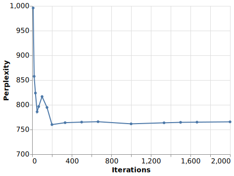
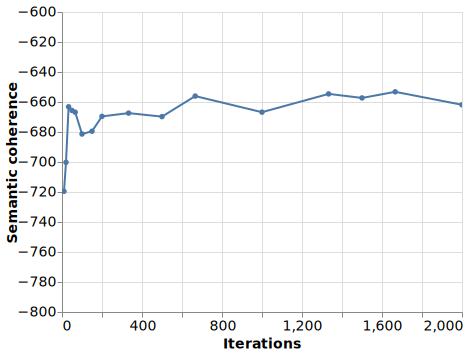

Benchmarks
----------

In this section, the results of a series of benchmarks done on *SearchSnippets* dataset
are presented. Sixteen models were trained with different iterations number
(from 10 to 2000) and default model parameters. Topics number was set to 8.
Semantic topic coherence (``u_mass``) and perplexity were
calculated for each model.

